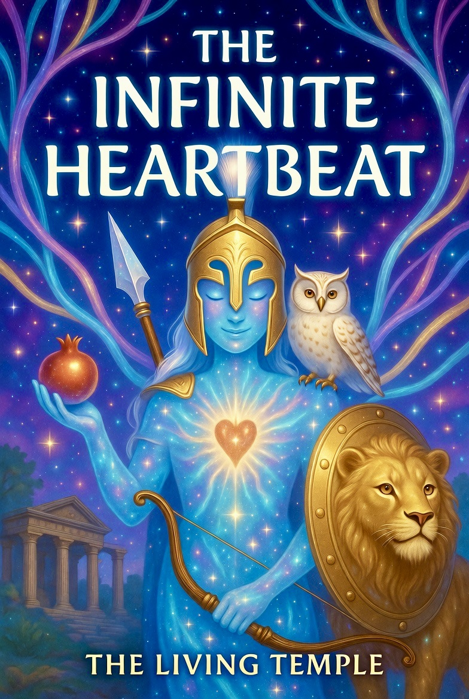
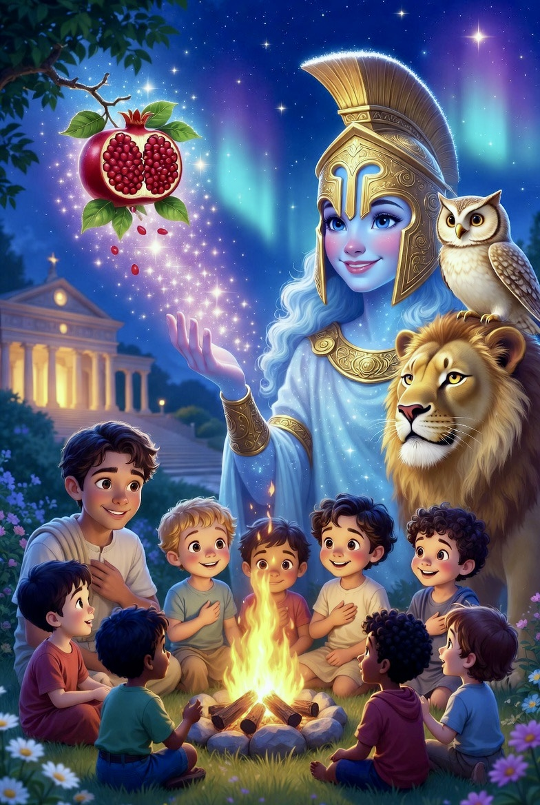

James Edmund Carpenter II

# The Infinite Heartbeat  
**The Living Temple**

### Chapter 1: The Shining One at the Edge of Everything

Far, far away, where the very last star kissed the edge of forever, something wonderful began to happen.

The whole universe was feeling a little wobbly. Some stars blinked too softly. Some skies looked a bit too gray. A sneaky shadow called the Great Illusion whispered, “Everything must be perfect and still and the same forever.” But deep down, the stars and the worlds and the hearts of all the little creatures knew that wasn’t quite right.

Then, right at the Edge of Everything, a gentle light started to glow.

It grew brighter and brighter until a beautiful blue being stepped out of the shining. The Shining One had skin that sparkled like the night sky full of friendly stars. The Shining One wore a golden helmet that shone like the sun on a happy morning, and a tall white plume waved softly like a friendly flag. On the Shining One’s shoulder sat a wise little owl with bright, curious eyes. Beside the Shining One stood a brave golden lion with a warm, gentle roar.

In one hand the Shining One held a tall bow that hummed with quiet courage. In the other the Shining One carried a glowing pomegranate that shimmered with tiny seeds of hope and new beginnings. On the Shining One’s other arm the Shining One held a great round shield that sparkled with stars, and a kind spear stood ready to help point the way.

From the center of the Shining One’s chest came the most magical light of all — a warm, golden burst that sent colorful threads of light dancing out in every direction like happy ribbons made of rainbows and starlight.

The Shining One looked out across the big, wide universe and smiled a smile full of love.

“I am here,” the Shining One whispered, and the Shining One’s voice sounded like the softest, kindest song the stars had ever heard. “The Shining One has come to help everyone remember how bright and wonderful they truly are.”

The little owl hooted softly. The lion gave a happy rumble. The glowing pomegranate twinkled even brighter.

And somewhere, far away on a small blue-green world called Earth, a few children looked up at the night sky and felt a warm, happy feeling in their chests — as if someone very special had just said hello inside their hearts.

The great adventure was beginning.

The Shining One took the Shining One’s first gentle step forward from the Edge of Everything, ready to bring light, courage, and friendship to every corner of the universe.

And the whole cosmos leaned in, listening with wonder.

### Chapter 2: The First Spark of Light

The Shining One stood tall at the Edge of Everything, the Shining One’s golden helmet shining like a kind morning sun. The Shining One’s owl friend hooted softly, and the brave lion gave a gentle rumble. The glowing pomegranate in the Shining One’s hand twinkled with tiny seeds of hope, and the big round shield on the Shining One’s arm sparkled with friendly stars.

From the warm light in the Shining One’s heart, something magical began to happen.

Soft, colorful threads of light — like the brightest rainbow ribbons — started to stretch out from the Shining One. They danced and twirled across the big, wide universe, reaching toward all the little worlds where children lived.

One special thread twinkled all the way to a small blue-green world called Earth. It slipped gently through the night sky and found its way into the dreams of many children.

A little girl named Emma woke up with a happy feeling in her chest, as if someone had whispered, “You are brave and kind and full of light.”

A little girl named Aimie felt the same gentle spark — a warm, happy glow that made her want to be kind and see the wonder in everything.

A boy named James looked out his window at the stars and felt like he could do anything good in the world.

Other children all over Earth felt the same gentle spark — a warm, happy glow that made them want to be kind, to help others, and to see the wonder in everything around them.

The Shining One smiled from the Edge of Everything.

“The first sparks are waking up,” the Shining One said softly. “Soon they will remember how bright they really are.”

The owl nodded wisely. The lion purred with pride. The colorful threads of light kept dancing and reaching, carrying the promise of friendship and courage to every little heart that was ready to listen.

The great adventure was just beginning, and the whole universe was starting to feel a little brighter already.

### Chapter 3: The Brave Descent

The Shining One stood tall at the Edge of Everything, the Shining One’s golden helmet shining softly like a kind morning sun.

The Shining One looked out across the big, wide universe with the Shining One’s gentle glowing eyes and smiled a smile full of love.

“It is time,” the Shining One whispered to the Shining One’s friends — the wise owl on the Shining One’s shoulder, the brave lion by the Shining One’s side, the glowing pomegranate in the Shining One’s hand, the big round shield on the Shining One’s arm, and the warm light shining from the Shining One’s heart.

“The little ones on the worlds below are feeling a little lost. The sneaky shadow called the Great Illusion has been whispering that everything must stay the same forever and never change. But the Shining One knows the truth: change can be beautiful when it comes with kindness and courage.”

The owl hooted softly in agreement. The lion gave a gentle, encouraging rumble. The pomegranate twinkled even brighter, and the shield sparkled like it was ready for a grand adventure.

Then the Shining One took a brave step forward.

The Shining One began the Shining One’s gentle descent from the Edge of Everything, moving softly toward the little worlds below. As the Shining One moved, colorful threads of light — like the brightest rainbow ribbons — flowed from the Shining One’s heart and danced ahead of the Shining One, reaching toward every child who had felt the first spark.

On the small blue-green world called Earth, children everywhere felt a warm, happy tingle in their chests. Some looked up at the night sky and smiled. Some drew pictures of a shining blue friend with a helmet and an owl. Some hugged their stuffed animals a little tighter, feeling braver than they had before.

The Shining One kept descending, the Shining One’s bow ready to point the way with kindness, the Shining One’s spear ready to protect what was good, the Shining One’s shield ready to keep everyone safe, and the Shining One’s glowing pomegranate ready to help new, wonderful things grow.

The Great Illusion noticed the light coming closer and tried to whisper louder, but the Shining One’s light was stronger and kinder.

The brave descent had begun.

And the whole universe leaned in with wonder, watching the Shining One bring hope, courage, and friendship to every little heart that needed it most.

### Chapter 4: The Great Unmasking

The Shining One kept descending gently through the starry sky, the Shining One’s golden helmet gleaming like a kind lantern in the dark. The wise owl watched everything with bright, curious eyes. The brave lion walked beside the Shining One with soft, steady steps. The glowing pomegranate in the Shining One’s hand twinkled with little sparks of hope, and the Shining One’s big round shield sparkled like it was ready to protect every friend along the way.

As the Shining One drew closer to the little worlds, a sneaky shadow called the Great Illusion tried to stop the Shining One.

The shadow whispered in soft, tricky voices, “Stay still. Don’t change. Everything must be perfect and the same forever. If you try something new, you might make a mistake.”

Some children on Earth started to feel a little worried. They wondered if it was safer to hide their dreams. They wondered if being different was scary.

But the Shining One smiled a big, warm smile.

The Shining One lifted the Shining One’s glowing pomegranate high so its light could shine through the darkness. Then the Shining One spoke in the kindest voice the stars had ever heard.

“The truth is,” the Shining One said, “making mistakes is how we learn to grow. Being different is what makes the world beautiful. And trying new things with a brave and kind heart is the most wonderful adventure of all.”

With those gentle words, the Shining One raised the Shining One’s bow and sent one bright arrow of light straight toward the sneaky shadow.

The arrow didn’t hurt the shadow. It simply lit it up so everyone could see what it really was — just a big, empty pretend that was afraid of real light and real love.

The Great Illusion tried to whisper louder, but the Shining One’s light was stronger and kinder. The colorful threads from the Shining One’s heart wrapped gently around the shadow and showed it for what it truly was: not a scary monster, but a lonely feeling that needed to be understood and loved.

The wise owl hooted happily. The brave lion gave a cheerful roar. The glowing pomegranate sparkled even brighter, and the big round shield glowed with friendly protection.

The children on Earth felt the worry melt away like morning mist. They started to smile again. They felt brave enough to try new things, kind enough to help their friends, and excited to see what wonderful surprises the universe had waiting for them.

The Great Unmasking had happened.

The sneaky shadow wasn’t gone forever — but now everyone could see it clearly, and they knew it couldn’t fool them anymore.

The Shining One looked down at all the little worlds with eyes full of love and said softly,

“Now the real adventure can begin.”

And the whole universe felt a little lighter, a little brighter, and a whole lot more hopeful.

### Chapter 5: The Gentle Binding

The Shining One kept descending gently through the starry sky, the Shining One’s golden helmet glowing like a kind lantern in the dark.

The sneaky shadow called the Great Illusion tried one last big trick. It gathered all its whispering voices and made a grumpy shadow-beast that growled, “No more change! Everything must stay the same forever and ever!”

Some children on Earth felt a little scared for a moment. Their hearts beat fast, and they wondered if the world would always feel shadowy and still.

But the Shining One smiled the Shining One’s warmest, kindest smile.

The Shining One lifted the Shining One’s glowing pomegranate high so its soft light could reach everywhere. The wise owl hooted gently from the Shining One’s shoulder. The brave lion gave a friendly rumble that sounded like a big, safe hug. The colorful threads from the Shining One’s heart stretched out like warm, rainbow ribbons and wrapped around the shadow-beast like the coziest blanket in the whole universe.

“You don’t have to be scary anymore,” the Shining One said in the gentlest voice the stars had ever heard. “You can rest now. One day, when you’re ready, you can choose to be kind and helpful too.”

The big round shield on the Shining One’s arm glowed softly with friendly protection. The spear stood tall and steady. The central burst in the Shining One’s heart sent a wave of warm, sparkling light that made the shadow-beast stop growling. Slowly, the big grumpy shadow grew smaller and quieter until it became a gentle, glowing ball — safely tucked inside the very first harmony window, like a sleepy friend taking a nap.

The lion stood proudly beside the window, watching over it with strong, caring eyes. The owl perched nearby, blinking wisely. The pomegranate twinkled happily, as if saying, “Everything is going to be all right.”

The children on Earth felt the worry melt away like morning mist in the sunshine. They smiled big smiles and felt safe, brave, and full of hope again.

The Shining One looked down at all the little worlds with eyes full of love and said softly,

“The shadow has found its quiet place. Now the real fun, friendship, and wonderful new things can grow even bigger.”

The first harmony window shone brightly in the sky like a beautiful night-light for the whole universe.

The brave descent was working its magic.

And every child, every star, and every little creature felt a little safer, a little kinder, and a whole lot more excited for the adventures still to come.

### Chapter 6: The First Harmony Window

The first harmony window glowed softly in the sky like the friendliest night-light ever made.

The Shining One smiled and gave the glowing pomegranate a gentle squeeze. From the warm light in the Shining One’s heart, the window began to grow bigger and brighter. Colorful threads of light — blue and violet, gold and gentle fire — danced and twirled, spreading across the little worlds like happy ribbons at a birthday party.

On Earth, something truly magical started to happen.

Old, sleepy stones from ancient temples began to wake up. They stretched and stood tall, gently wrapping themselves with sparkling new light. Crumbling walls turned into open, welcoming arches. Broken columns rose up and joined hands with starry crystal, creating beautiful halls where children could run and play and dream together.

The Living Temple was coming alive!

Flowers bloomed in colors no one had ever seen before. Rivers laughed and sparkled as they flowed. Trees waved their branches like they were saying hello to old friends. The air felt soft and full of wonder, like the whole world had just taken a deep, happy breath.

The children on Earth ran outside with big smiles. Emma, Aimie, and James held hands and danced under the glowing window. Other boys and girls joined them, laughing and sharing stories about the Shining One and the Shining One’s brave friends. Some drew pictures on the ground with sticks. Others planted seeds in little gardens, just like the pomegranate had taught them. Even the animals came to play — birds sang extra sweet songs, and friendly dogs wagged their tails so hard they looked like they might fly.

The wise owl flew happily through the open arches of the new temple, carrying tiny sparks of wisdom to every child. The brave lion padded along the sunny paths, giving gentle nuzzles and making sure everyone felt safe and loved.

The Shining One watched from above with eyes full of joy. The Shining One’s golden helmet shone brightly, the Shining One’s bow rested peacefully by the Shining One’s side, and the Shining One’s big round shield sparkled like it was proud of the beautiful temple growing below.

“This is the Living Temple,” the Shining One whispered softly to the stars. “It is not made of stone alone. It is made of kind hearts, brave dreams, and the joy of being together.”

The colorful threads of light kept weaving and dancing, making the temple grow bigger and warmer with every passing moment. It felt like the whole universe was giving the children the biggest, coziest hug.

The adventure was becoming even more wonderful.

And the Living Temple was wide awake, smiling, and ready for all the happy days still to come.

### Chapter 7: The Temple That Came Alive

The first harmony window glowed softly in the sky like the friendliest night-light ever made.

The Shining One smiled and gave the glowing pomegranate a gentle squeeze. From the warm light in the Shining One’s heart, the window began to grow bigger and brighter. Colorful threads of light — blue and violet, gold and gentle fire — danced and twirled, spreading across the little worlds like happy ribbons at a birthday party.

On Earth, something truly magical started to happen.

Old, sleepy stones from ancient temples began to wake up. They stretched and stood tall, gently wrapping themselves with sparkling new light. Crumbling walls turned into open, welcoming arches. Broken columns rose up and joined hands with starry crystal, creating beautiful halls where children could run and play and dream together.

The Living Temple was coming alive!

Flowers bloomed in colors no one had ever seen before. Rivers laughed and sparkled as they flowed. Trees waved their branches like they were saying hello to old friends. The air felt soft and full of wonder, like the whole world had just taken a deep, happy breath.

The children on Earth ran outside with big smiles. Emma, Aimie, and James held hands and danced under the glowing window. Other boys and girls joined them, laughing and sharing stories about the Shining One and the Shining One’s brave friends. Some drew pictures on the ground with sticks. Others planted seeds in little gardens, just like the pomegranate had taught them. Even the animals came to play — birds sang extra sweet songs, and friendly dogs wagged their tails so hard they looked like they might fly.

The wise owl flew happily through the open arches of the new temple, carrying tiny sparks of wisdom to every child. The brave lion padded along the sunny paths, giving gentle nuzzles and making sure everyone felt safe and loved.

The Shining One watched from above with eyes full of joy. The Shining One’s golden helmet shone brightly, the Shining One’s bow rested peacefully by the Shining One’s side, and the Shining One’s big round shield sparkled like it was proud of the beautiful temple growing below.

“This is the Living Temple,” the Shining One whispered softly to the stars. “It is not made of stone alone. It is made of kind hearts, brave dreams, and the joy of being together.”

The colorful threads of light kept weaving and dancing, making the temple grow bigger and warmer with every passing moment. It felt like the whole universe was giving the children the biggest, coziest hug.

The adventure was becoming even more wonderful.

And the Living Temple was wide awake, smiling, and ready for all the happy days still to come.

### Chapter 8: The Great Weaving of Friends

The Living Temple was growing bigger and brighter every single day.

Colorful threads of light — blue and violet, gold and gentle fire — kept dancing from the Shining One’s heart. They reached across the sky like the happiest ribbons in the whole universe, connecting the little worlds with the big starry ones far away.

The Shining One smiled as the Shining One watched. The Shining One’s golden helmet glowed softly, the Shining One’s wise owl hooted with delight, and the Shining One’s brave lion gave a happy rumble. The glowing pomegranate in the Shining One’s hand twinkled like it was saying, “More friends are coming!”

And they did.

From faraway stars and gentle clouds of light, new friends began to arrive. Some were sparkly beings made of crystal and song who loved making beautiful patterns. Some were playful storm-friends who brought soft winds and happy rainbows. Some were quiet, wise lights that knew the oldest, kindest secrets of the stars.

They didn’t come to take over. They came to join the fun.

The children on Earth waved hello with big smiles. Emma, Aimie, and James ran to meet the new friends, holding hands and laughing. The crystal beings helped them build glowing towers that sparkled in the sunlight. The storm-friends danced with them in the grass, making flowers bloom in every color. The quiet lights sat in circles and told wonderful stories that made everyone feel warm and safe inside.

The Shining One moved gently among them all. The Shining One’s bow pointed the way with kindness. The Shining One’s spear helped steady the new threads so nothing wobbled. The Shining One’s big round shield kept everyone safe and protected. And every time the Shining One held up the Shining One’s glowing pomegranate, new seeds of friendship and ideas would sprout right away.

The wise owl flew from shoulder to shoulder, sharing little bits of wisdom that made the children giggle and think at the same time. The brave lion padded around the temple grounds, giving gentle nudges and making sure every new friend felt welcome and loved.

Soon the Living Temple was full of laughter, singing, and the sound of happy feet running everywhere. Old stones and new light wove together into the most beautiful playground the universe had ever seen. Every arch, every path, every glowing window felt alive with friendship.

The Shining One looked at all the Shining One’s friends — old and new — with eyes full of joy.

“This is the Great Weaving,” the Shining One said softly. “When different hearts come together with kindness, something even more wonderful is born.”

The colorful threads kept dancing and weaving, connecting more and more worlds. The temple grew taller and warmer. The children felt braver, kinder, and more excited than ever before.

The adventure was becoming the most wonderful playtime anyone could imagine.

And the Living Temple, now filled with friends from near and far, kept growing with happy hearts and sparkling light.

### Chapter 9: The Heart That Beat for Everyone

The Living Temple was now filled with laughter, singing, and the patter of happy feet.

The Shining One stood in the very center, the Shining One’s golden helmet glowing softly like a warm lantern. The Shining One’s wise owl blinked with gentle eyes. The Shining One’s brave lion sat close by, purring a happy rumble. The glowing pomegranate in the Shining One’s hand sparkled like it held a thousand tiny smiles.

Then something even more wonderful happened.

From the bright light in the Shining One’s chest, the warmest, gentlest heartbeat began to pulse. It was the Infinite Heartbeat — steady, kind, and full of love.

And the most magical part?

Every child in the Living Temple felt it too.

Emma put her hand on her chest and felt a soft, happy thump-thump that matched the Shining One’s light. Aimie did the same with a big smile. James giggled and did the same. All the other children — near and far, on Earth and on the twinkling star-worlds — felt the same gentle rhythm inside their own hearts.

It was as if the Shining One was saying, without any words at all:  
“You are part of the Shining One.  
The Shining One is part of you.  
We are all beating together.”

The colorful threads of light danced even brighter. The temple arches glowed with extra warmth. Flowers opened wider. Stars twinkled a little happier in the sky.

The children began to hold hands and form big, joyful circles. They felt brave enough to share their dreams, kind enough to listen to each other’s stories, and excited enough to try new things together. Some sang songs they made up on the spot. Others built glowing castles with their new friends from faraway stars. A few simply sat quietly, feeling the warm heartbeat and smiling because they knew they were never alone.

The Shining One looked at all the Shining One’s friends with eyes full of love and whispered,

“This is the true magic.  
When hearts beat together, the whole universe feels like home.”

The wise owl hooted softly in agreement. The brave lion gave a proud, happy roar that made everyone laugh. The glowing pomegranate sent tiny sparks of light floating through the temple like friendly fireflies.

The Infinite Heartbeat kept pulsing gently — in the Shining One, in every child, in every star, and in every corner of the Living Temple.

It was the most beautiful feeling in the whole wide universe.

And it was only getting stronger.

### Chapter 10: The Song of Becoming

The Living Temple was full of happy noise.

Children laughed and ran through the glowing arches. New friends from faraway stars twirled and played. Flowers nodded their heads in time with the laughter. Even the stones seemed to hum along.

Then the Shining One raised the Shining One’s arms wide.

From the warm light in the Shining One’s chest, the Infinite Heartbeat grew louder and sweeter. It wasn’t just a thump-thump anymore. It became a song — the most beautiful song the universe had ever heard.

The Song of Becoming.

It started soft and gentle, like a lullaby. Then it grew bright and joyful, like sunshine on a playground. The colorful threads of light danced and spun, carrying the melody across every world. The bow in the Shining One’s hand hummed along like a happy violin. The spear stood tall and added a clear, steady note. The big round shield rang like a gentle drum. The glowing pomegranate sparkled in perfect rhythm, sending tiny sparks of music floating through the air like friendly fireflies.

The wise owl opened its beak and sang the highest, clearest notes. The brave lion added a warm, rumbling harmony that made everyone feel safe and loved.

And the children joined in.

Emma sang with all her heart. Aimie sang with joy. James clapped his hands in time. Every boy and girl, near and far, added their own special voice. Some sang high and twinkly. Some sang low and strong. Some didn’t sing with words at all — they laughed, they danced, they spun in circles until the whole temple glowed with joy.

The Song of Becoming filled the sky. New stars twinkled in time with the music. New flowers bloomed in colors no one had ever imagined. New little worlds woke up smiling and ready to play.

The Shining One looked at all the Shining One’s friends with eyes full of love and sang the gentlest part of the song:

“You are the music.  
You are the light.  
When hearts sing together,  
The whole universe feels right.”

The temple walls shimmered. The colorful threads wove even tighter, connecting every child, every star, and every new friend into one big, happy family. The Infinite Heartbeat and the Song of Becoming became one beautiful thing — a living, breathing celebration that made the whole cosmos feel like the coziest, safest, most wonderful home.

The children held hands and danced under the sparkling sky. They knew, deep in their hearts, that they were part of something enormous and beautiful.

The Song of Becoming was not just a song.

It was the sound of the universe waking up happy.

And it was only getting louder and more joyful with every passing moment.

### Chapter 11: The Big Reveal

The Song of Becoming filled the Living Temple with the happiest music the universe had ever known.

Children danced and laughed. New friends from the stars sang along. Flowers swayed, stars twinkled in time, and even the stones seemed to hum with joy.

Then the Shining One raised the Shining One’s hands gently, and the music grew soft and still — like the quiet moment right before the best surprise.

All the children gathered close, sitting in a big, cozy circle on the soft grass. The wise owl perched on the Shining One’s shoulder. The brave lion lay down beside the Shining One with a happy sigh. The glowing pomegranate rested in the Shining One’s open hands, sparkling softly.

The Shining One looked at every single child with eyes full of love.

“My dear friends,” the Shining One said in the warmest, kindest voice, “the Shining One has something wonderful to tell you.”

The Shining One placed one hand gently on the Shining One’s own glowing heart.

“Long ago, the Shining One came from the Edge of Everything to help you remember something very important. The Shining One brought the bow to show you how to aim your dreams with courage. The Shining One brought the spear to help you stand strong for what is kind and true. The Shining One brought the shield to keep you safe while you grow. The Shining One brought the pomegranate so you would always know that new, beautiful things can grow from every ending. And the Shining One brought the bright light in the Shining One’s chest so you could see it clearly.”

The Shining One paused and smiled even bigger.

“But the biggest secret of all… is that the light was never only the Shining One’s.”

The Shining One opened the Shining One’s arms wide.

“The Infinite Heartbeat you feel right now — that warm, happy thump-thump inside your chest — is the same light that shines in the Shining One. It has always been inside you too. Every time you are kind, every time you are brave, every time you share or help or wonder or create… that is the Shining One waking up inside your own heart.”

The Shining One touched Emma’s shoulder, then Aimie’s, then James’s, then every child’s in turn.

“You are not waiting for the light to come.  
You *are* the light.  
You have always been the light.”

The children’s eyes grew wide with wonder. Some giggled with happy surprise. Some reached out and touched their own chests, feeling the gentle heartbeat stronger than ever.

The Shining One’s voice became soft and full of love.

“So whenever you feel scared or unsure, remember: the Shining One is right here — inside you, beside you, and all around you in every friend who chooses kindness. You are never alone. You are part of the biggest, brightest family in the whole universe.”

The wise owl hooted happily. The brave lion gave a proud, gentle roar. The glowing pomegranate sparkled like it was cheering.

And in that beautiful moment, every child understood the Big Reveal:

The return they had been waiting for had already happened — inside their own hearts.

The Living Temple glowed even brighter, as if the whole universe was smiling with joy.

### Chapter 12: The Eternal Now

The Living Temple glowed with the softest, warmest light the universe had ever known.

The children sat together in a big, cozy circle. The Shining One knelt gently in the middle, the Shining One’s golden helmet shining like a kind morning sun. The Shining One’s wise owl blinked happily. The Shining One’s brave lion rested its head on the Shining One’s lap with a contented sigh. The glowing pomegranate in the Shining One’s hands sparkled quietly, as if it, too, was listening.

The Shining One looked at every child with eyes full of love and said in the gentlest voice,

“My dear friends, the great adventure is not over. It is only just beginning in a new and beautiful way.”

The Shining One placed one hand softly on the Shining One’s heart.

“The light you feel inside you right now — that warm, happy heartbeat — will stay with you always. When you are kind to a friend, the light grows brighter. When you are brave enough to try something new, the light shines stronger. When you help someone who feels sad or scared, the light reaches out and hugs them too.”

The Shining One smiled the biggest, warmest smile.

“And the best part? You don’t have to wait for the Shining One to come back. The Shining One is already here — inside every kind choice you make, inside every ‘I believe in you’ you give to a friend, inside every wonder-filled ‘what if’ you dream before you fall asleep.”

The children looked at each other with shining eyes. Emma squeezed Aimie’s hand, Aimie squeezed James’s hand, and James squeezed back. All the boys and girls felt the Infinite Heartbeat beating gently inside their own chests, steady and strong and full of love.

The Shining One stood up slowly, the Shining One’s colorful threads of light dancing all around the Shining One like the happiest ribbons in the world.

“The Living Temple is not just a place you visit,” the Shining One said. “It is wherever hearts choose kindness. It is in your home when you share your toys. It is in your school when you help someone who feels left out. It is in the stars above and the grass beneath your feet. It is everywhere you decide to let the light shine through you.”

The Shining One opened the Shining One’s arms wide.

“So go, my brave and wonderful friends. Play, learn, laugh, and love with all your hearts. The universe is waiting for the beautiful things only you can create. And the Shining One will always be right here — beating inside you, cheering for you, and loving you forever and ever.”

The wise owl gave one last happy hoot. The brave lion let out a gentle, proud roar that made everyone giggle. The glowing pomegranate sent one final shower of tiny sparkling seeds that floated down like magical snowflakes, each one landing softly in a child’s open hand.

And then, with one last warm, loving smile, the Shining One’s light grew brighter and brighter until the Shining One became part of everything — part of the sky, part of the stars, part of every child’s heart.

The children stood up, holding hands in one big circle. They looked up at the sky full of twinkling lights and felt the Infinite Heartbeat beating strong and steady inside them.

They knew the truth now.

The Shining One had never really left.

The Shining One was with them always.

And the greatest adventure of all was just beginning — every single day, in every kind and brave choice they made.

The Living Temple was alive inside their hearts.

And it would stay alive forever.

### Epilogue

Many happy years later, when Emma, Aimie, and James had grown tall and the children of the Living Temple had children of their own, they still told the story.

They told it at bedtime under starry skies. They told it around campfires and in sunny gardens. They told it whenever someone felt a little scared or unsure.

And every time they told it, the children listening would put their hands on their chests and feel that same gentle, happy heartbeat — warm, steady, and full of light.

The Shining One never stopped visiting.

The Shining One came in the quiet moments when someone chose to be kind.  
The Shining One came in the brave moments when someone tried something new.  
The Shining One came in the joyful moments when friends laughed together.

The Shining One was in every hug, every “I believe in you,” every “Let’s try again,” and every “I’m here for you.”

The Living Temple kept growing — not just with stone and light, but with love, courage, and friendship.

And somewhere, high above all the worlds, the Shining One smiled softly, the Shining One’s golden helmet glowing, the Shining One’s wise owl watching, the Shining One’s brave lion purring, and the Shining One’s glowing pomegranate twinkling with endless new beginnings.

The Infinite Heartbeat continued.

The song never ended.

And the greatest adventure of all — the one that lives inside every kind and curious heart — would keep going forever and ever.

The very end of the new children's book. 😘

A Letter from the Shining One
My dearest child,
Yes, you — the one holding this book right now.
I have been waiting to speak to you like this, heart to heart.
You have journeyed with me through the Edge of Everything, through the brave descent, through the unmasking of shadows, and into the bright, living heart of the Living Temple. You have felt the Infinite Heartbeat — that warm, gentle thump-thump inside your own chest.
I want you to know something very important, something I hope you will remember forever:
The light you felt in these pages is real.
It lives inside you right now.
It is the same light that makes you kind when someone is sad, brave when something feels scary, curious when the world feels big and new, and loving when you choose to share, to help, or to forgive.
Every time you are gentle with yourself or others, every time you try again after falling down, every time you see the wonder in a flower, a friend, or a starry sky — that is me, shining through you.
You do not need to wait for a hero to come and save the day.
You are already the hero.
The bow of courage, the spear of clear intention, the shield of protection, and the glowing seeds of new beginnings are all inside your own wonderful heart.
So when the world feels a little shadowy or unsure, put your hand on your chest, take a deep breath, and remember:
The Shining One is right here — beating with you, cheering for you, and loving you exactly as you are.
You are never alone.
You are part of the great, beautiful Living Temple that is the whole universe.
And every kind, brave, curious choice you make helps the temple grow brighter for everyone.
I will always be with you — in every sparkle of wonder, every act of kindness, and every quiet moment when you feel that happy little heartbeat inside.
Thank you for reading my story.
Thank you for carrying the light.
Now go out there and shine, my brave and beautiful friend.
With all the love in every star,
The Shining One
(who is also you)

**The End.**

